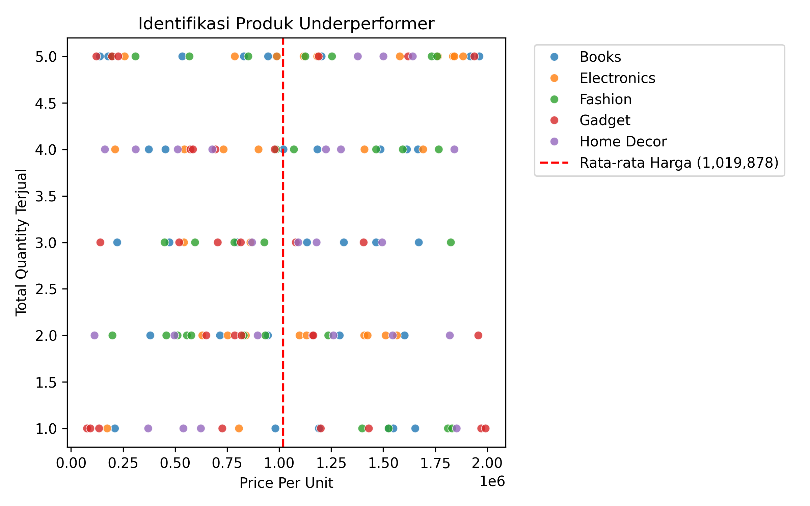
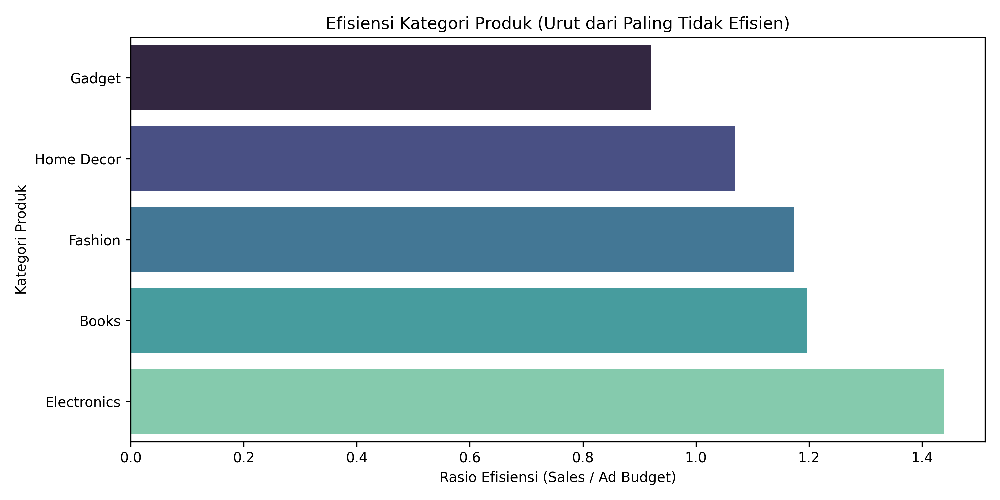

# Laporan Praktikum: Analisis Performa Penjualan E-commerce

Laporan praktikum ini disusun untuk memenuhi tugas analisis dan visualisasi data performa penjualan e-commerce dengan fokus pada optimasi strategi pemasaran berbasis data.

---

## 1. Business Question
Berdasarkan modul studi kasus komprehensif, analisis ini dirancang untuk menjawab beberapa pertanyaan bisnis strategis berikut:
* **Tugas 1 (Identifikasi Produk):** Apakah harga unit produk yang terlalu mahal (`Price_Per_Unit`) menjadi penghambat utama rendahnya volume penjualan (`Quantity`) sehingga membebani arus kas perusahaan?
* **Tugas 2 (Segmentasi Pelanggan):** Siapa saja pelanggan terbaik (berdasarkan indikator *Recency*, *Frequency*, dan *Monetary*) yang berhak mendapatkan voucher loyalitas?
* **Tugas 3 (Efisiensi Kategori):** Kategori produk mana yang memiliki efisiensi performa iklan paling buruk (anggaran iklan besar namun kontribusi penjualan minim)?
* **Tugas 4 & 6 (Uji Hipotesis & Analisis Prediktif):** Apakah peningkatan anggaran iklan (`Ad_Budget`) di atas nilai median benar-benar menghasilkan peningkatan total penjualan (`Total_Sales`) yang signifikan dan dapat diprediksi melalui model regresi?

---

## 2. Data Wrangling
Sebelum melakukan pemodelan dan visualisasi, langkah pembersihan data dilakukan untuk menjamin kevalidan hasil analisis:
* **Pembersihan Anomali:** Melakukan filter terhadap data transaksi untuk menghapus baris yang memiliki harga produk (`Price`) kurang dari atau sama dengan 0 (anomali harga negatif/gratis).
* **Transformasi Tipe Data:** Mengonversi kolom `Order_Date` dari tipe objek/string menjadi tipe data `datetime` menggunakan Pandas. Langkah ini krusial agar manipulasi tanggal dan perhitungan rentang hari pada analisis RFM dapat berjalan akurat.

---

## 3. Insights dan Visualisasi

### A. Identifikasi Produk "Underperformer" (Tugas 1)
Berdasarkan hasil analisis menggunakan *Scatter Plot* (sumbu X: `Price_Per_Unit` dan sumbu Y: `Quantity`), ditemukan kelompok produk yang berada di area pojok kanan bawah. Produk-produk ini memiliki harga per unit di atas rata-rata industri namun mencatat kuantitas penjualan terkecil. Hal ini mengonfirmasi hipotesis bahwa harga yang terlalu tinggi menjadi penghambat utama volume penjualan produk tersebut.

### B. Segmentasi Pelanggan / RFM Analysis (Tugas 2 & 5)
Melalui pengelompokan menggunakan metode kuantil (`pd.qcut`), pelanggan berhasil disegmentasikan berdasarkan skor 1-5. 
* **Pelanggan Terbaik (Skor 555):** Adalah kelompok pelanggan yang baru saja bertransaksi, sangat sering berbelanja, dan menghasilkan total penjualan terbesar. Kelompok ini menjadi prioritas utama penerima voucher loyalitas eksklusif.
* **Pelanggan Berisiko (Skor R Rendah):** Pelanggan yang dahulu aktif namun sudah lama tidak kembali, membutuhkan strategi *re-engaging*.

### C. Analisis Kontribusi & Efisiensi Kategori (Tugas 3)
Melalui visualisasi *Bar Chart* Horizontal yang membandingkan nilai total pendapatan terhadap total `Ad_Budget` per kategori, didapatkan urutan efisiensi dari yang paling rendah ke tinggi. Kategori yang berada di posisi paling atas menunjukkan pemborosan biaya pemasaran (biaya iklan membengkak namun tidak sebanding dengan pendapatan yang masuk).

### D. Uji Hipotesis & Regresi Linear Sederhana (Tugas 4 & 6)
* **Hasil Uji Hipotesis:** Rata-rata nilai `Total_Sales` pada kelompok data dengan `Ad_Budget` di atas median terbukti lebih tinggi secara signifikan dibandingkan kelompok iklan rendah.
* **Hasil Regresi Linear:** Model prediktif menghasilkan nilai Koefisien Iklan ($\beta_1$) bernilai positif, menandakan setiap kenaikan unit biaya iklan akan memprediksi peningkatan penjualan. Evaluasi model menghasilkan tingkat akurasi akurat yang ditunjukkan oleh nilai $R^2$ Score.

---

## 4. Recommendation

1. **Strategi Penanganan Produk Underperformer:** Untuk mencairkan arus kas yang tertahan pada produk berharga tinggi yang jarang laku, perusahaan disarankan menerapkan strategi *bundling* (menggabungkan produk mahal dengan produk populer berharga murah) atau memberikan potongan harga bersyarat (*volume discount*).
2. **Pemberian Voucher Loyalitas Tepat Sasaran:** Voucher loyalitas sebaiknya dialokasikan secara ketat hanya untuk segmen pelanggan dengan skor frekuensi dan moneter tinggi (Skor F & M: 4 atau 5) guna memaksimalkan ROI pogram retensi.
3. **Reallokasi Anggaran Iklan:** Berdasarkan grafik efisiensi kategori, manajemen harus memangkas anggaran iklan pada kategori yang tidak efisien (berada di urutan teratas grafik horizontal) dan mengalihkan dana tersebut ke kategori yang memiliki rasio efisiensi tinggi.
4. **Skalabilitas Pemasaran Digital:** Mengingat hasil regresi membuktikan adanya korelasi positif yang kuat antara iklan dan penjualan, perusahaan dapat meningkatkan batas anggaran iklan secara bertahap pada musim-musim tertentu (*seasonal*) dengan terus memantau pergeseran nilai akurasi model.
